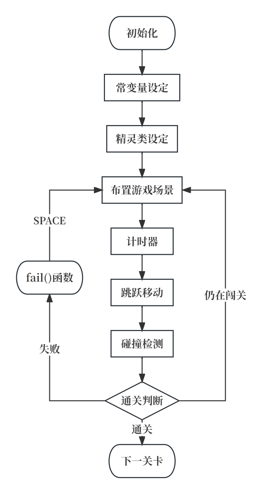

# “道阻且长，行而不辍”开发文档

## 0 写在前面

北航软件学院的大二新生，在开启秋季学期前，会经历大学生涯第一次”小学期“的洗礼。所有软院同学们要用本就不多的代码技能去写一款属于自己的软件/游戏/网页/小程序。彼时的我，编码能力仅限于大一时学的那点儿C语言。本着扩充代码技术栈、但又不想增添太多负担的想法，我决定用简单的pygame写一款游戏。

游戏的选题，我构思了很久。毕竟是人生中第一款自己写的游戏，一定要标新立异一点才好。身边的同学们纷纷写起了五子棋、象棋、飞机大战、超级玛丽这些跟着B站视频按部就班做即可得到成品的游戏，我却认为这种缺乏创新的游戏一定不会得到老师的赏识。事实也的确如此，获得申优的作品，鲜有俗套的传统游戏，更多是投入心血、自主创新的作品，哪怕有许多瑕疵。

无意中，我想到了一款很久以前曾玩过4399小游戏**《生老病死》**，B站上也有关于这款游戏的解读。游戏十分简单，就是一个小人在下降的世界中跳方砖，经历人生各个阶段从而通关。但那款游戏给了我很深的印象，第一次玩的时候就深受触动：**浅显易懂的图形，温和平静的bgm，背后一直在转的时钟，多种人生轨迹引向的不同关卡难度，不同人生最终的归宿——死亡……**游戏在一种淡淡的忧伤中戛然而止，没有一句话，却使每个玩家陷入沉思。

就是它了！我要仿照这款游戏做一款属于自己的”模拟人生“！

虽然我的版本远比不上原作，在软件架构、代码逻辑上还有许多需要改进的地方，但当我回看在软院做的所有项目，我依然会认为这款游戏是我最满意、最有成就感的一个！

看到这里了，不妨点开根目录下的`道阻且长，行而不辍.exe`，开始游玩吧！通关以后，还请移步4399，体验一下原型神作**《生老病死》**，你会发现：一款游戏、一个软件的境界，不仅由技术体现，更是体现在它所传递的思想、所带来的人文关怀！

## 1 游戏概要

### 1.1 游戏背景
如今网络上闯关游戏对于主角大多采用“超级英雄”式的人物设定，这样脱离现实的设定固然能使玩家获得暂时的快感，但并不会在精神层面得到升华，或从游戏中收获一些道理。把自己作为游戏的主角才最能引起共鸣。
我们每个人的一生正如闯关游戏一样：

***升级，跨越障碍平台，寻找通关路径。（闯关）***
***成长，经历困难挫折，谋求生活之路。（人生）***

每个人的人生经历各不相同，因此每个人游玩此游戏的通关路径可能不同。但每个人都会经历生老病死，故所有玩家在游戏中的开局和结尾会是相同的：出生和死亡。闯关也顺理成章成为一个普通人视角里一生的经历。基于这种想法，我决心制作一款有深刻内涵的闯关游戏，引导玩家的思考，为游戏赋予更多的现实意义。

### 1.2 游戏总体描述
这是一款模拟人生的闯关游戏，游戏设置了四个关卡，分别代表少年、青年、中年、老年四个阶段。每个人生阶段都有不同人物行为设定，如速度差异、跳跃高度、各关卡通关难度等。玩家需要在每一个人生阶段跳跃平台障碍，在分岔面前做出正确的选择，在倒计时结束前进入下一个人生阶段。

玩家有可能误入歧途，也可能获得buff或debuff，玩家的通关方式可能较为轻松，也可能比较卖力，甚至需要重新出发。游戏通关的标志是最后的死亡。正如人的一生最终并不能用成功或失败衡量，游戏并不会告诉玩家成功还是失败。游戏的最终目的是通过或难或易的闯关，启发玩家们思考：该以何种方式度过这不平凡的一生？

### 1.3 游戏开发信息
开发语言：python

开发工具：pycharm

开发平台：Windows

部署环境：Windows

可执行文件名：道阻且长，行而不辍.exe

代码量：1300行

游戏作者：高铭 22373386

## 2 游戏架构
游戏大体为顺序结构，各界面都可以按下ESC键退出游戏，前一关游戏在规定时间内通关则自动切换至下一界面。若玩家在某阶段失败，则会跳出提示界面，指示玩家重新开始本阶段。下图为游戏逻辑流程图：


在最重要的main文件中，首先定义画布、图片、音频、颜色、长宽等一系列常量，为后面的函数做准备。

在人生四个阶段的函数内，首先的工作是对各参数进行初始设定，对倒计时器进行初始化，将游戏初始的障碍物加入`brick_group`精灵类，设置人物初始位置等。

随后，进入`while True`的循环。布置游戏中所需的插图、文字等，将精灵类的图片利用`brick_group.draw(SCREEN)`画在屏幕上。利用for循环，实现计时器、游戏退出和跳跃操作。接着，实现人物的左右移动和在受重力的物理环境下人物和`brick_group`的碰撞检测。最后，利用条件语句实现游戏失败和通关的判断，return至各自对应的函数，刷新屏幕。下图为游戏各关卡函数流程图：



需要特别说明的是，作者特意设置玩家在游戏中不可自选阶段，因为我们无法坐着时光机穿梭到人生某一阶段，只有从童年到老年、经历一次次跌倒再爬起来的过程，才是道阻且长、行而不辍的人生。

## 3 游戏设计及创新点
### 3.1 开始界面：
包含`menu_window` 和`guide_window`。`menu_window`为游戏封面，展示了**游戏标题、立意等**信息。`guide_window`为游戏提示，包含关卡通关指南和游戏制作说明。画面中有一个不断奔跑的小人，为提示界面增加动感的同时揭示了游戏的内涵：我们的一生都在**不停奔跑，如此往复**。该界面和此后各界面共用同一背景。按下空格即可切换至下一界面，按下ESC即可退出。

### 3.2 游戏界面：
分为`child_window`, `youth_window`, `adult_window` 和 `old_window`。通关后，自动加载出下一关卡的初始界面。

#### child_window
**新手引导**：跳跃难度循序渐进，由易到难。
**隐藏彩蛋**：玩家跳到乐器上会播放考级乐曲。
**分叉路设置**：右边为正确道路，左边无法通关。但误入歧途的成本并不大，仍可以跳回来重走一遍——简单难度。
**人物上升**的过程即象征成长的过程。
**难度简单**：象征童年的无忧无虑、天真美好。

#### youth_window
**多路径**：玩家走向终点有多种路径，殊途同归。
**隐藏buff**：问号箱代表不同buff，每种buff附带效果均不一样，获取后会有提示，引导玩家走向不同结局。游戏共设置7种buff供玩家探索。
**高考**：两条道路，高考失利虽然面临更多困难，但也有出路；反之也不一定顺利通关——逆境中成长
**移速更快、跳的更高**——青年人的青春活力
**难度中等**：选择错误的路径会迅速死亡，死亡界面会送给玩家忠告

#### adult_window
**插图丰富**：绘出工作后面临的种种大事，需要步步攀登。
**上升阶段**：处在事业、家庭的发展期，人生也在上升。
**下落阶段**：身体不如从前，人生开始走下坡路。
**重力逐渐变小**：人生阅历逐渐丰富，使得跳跃变得轻松。
**难度困难**：只给出一部分平台，其余需要玩家探索——世界充满未知，要勇于试错。

#### old_window
**移动速度大幅减慢**：模拟老年人的身体状况
**人生回溯**：每跳到一个台阶上，画面会播放出这个人生阶段中自己的经历，成为玩家的回忆
**别出心裁的设计**：一个台阶对应一个人生阶段，人的一生就是在爬台阶，最终走向离世的大门
**人物向上爬**的过程即象征成长的过程
**难度简单**：安享晚年，在慢节奏中回顾一生

### 3.3 结束界面：
当玩家通过全部关卡，切换至`gameover`界面结束界面写有游戏开发者**对于该游戏的解读**以及相关提示语，提示玩家按空格重新开始或按ESC退出。

### 3.4 失败界面：
若玩家因超时或坠落等需要重新开始，会有对应的失败界面提示，分别为`fail_serious`, `fail_timeout`, `fail_drug`，`fail_frustrate`。按下空格则跳转回当前阶段的初始界面。

## 4 关键算法
游戏中，玩家操作的人物是主体。按照面向对象编程的思想，我为游戏中四个关卡的人物分别设置了类，分别记为`player`, `youth`, `adult`, `old`。这些人物移动的频率不同，速度、重力加速度等变量均会有所不同。以第一关的`player`为例，代码如下：
```
class Player:
    def __init__(self, x, y):
        self.frames = [0] * 3 + [1] * 3 + [2] * 3 + [3] * 3 + [4] * 3 + [5] * 3
        self.idx = 0
        self.images = __main__.IMAGES['player']
        self.image = self.images[self.frames[self.idx]]     # 人物每一帧的图像列表
        self.rect = self.image.get_rect()                   # 每一帧所在的矩形
        self.rect.x = x
        self.rect.y = y
        self.width = self.image.get_width()
        self.height = self.image.get_height()
# velocity 速度
        self.y_vel = 15
        self.gravity = 2
```

对于移动跳跃，出于我更加熟悉面向过程编程的考虑，我采用直接在主函数中处理的方法，这样更有利于数据调试。设定bool变量以判断移动状态，根据移动状态执行操作。此外，移动时还需要展现人物动作变化，即图片的切换。我在player类中设定了`idx`变量和`frames`列表，随着时间推进，`idx`自增并与`len(frames)`取模，实现人物动作的动态变化。while循环中的关键代码如下：
```
# 跳跃
    if jumping:
        player.rect.y -= player.y_vel
        player.y_vel -= player.gravity  # 向上速度为正
        if player.rect.y == 740:        # 边界判断
            jumping = False
    for event in pygame.event.get():
        if event.type == pygame.KEYDOWN:
            if event.key == pygame.K_UP:
                jumping = True
                jumpSOUND.play()

# 左右移动
    LEFTMOVE = True
    RIGHTMOVE = True
    if player.rect.x < 2:  # 边界判断
        LEFTMOVE = False
    if player.rect.x > 620:
        RIGHTMOVE = False
    keys = pygame.key.get_pressed()
    if keys[pygame.K_LEFT] and LEFTMOVE:    # 向左走
        player.rect.x -= 130 * dt
        player.idx += 1
        player.idx %= len(player.frames)
        player.image = IMAGES['player'][player.frames[player.idx] + 6]
    if keys[pygame.K_RIGHT] and RIGHTMOVE:  #向右走
        player.rect.x += 130 * dt
        player.idx += 1
        player.idx %= len(player.frames)
        player.image = IMAGES['player'][player.frames[player.idx]]
    dt = CLOCK.tick(60) / 500
    SCREEN.blit(player.image, player.rect)
```

利用pygame提供的精灵类可以实现精灵之间的碰撞检测，但很大的不足之处是无法判断是从何方向碰撞的，因此我对横纵向的各种情况分别判断，根据判断结果做出人物速度、位置的调整。

此碰撞检测可以实现玩家在竖直向下坠到平台后速度置零，水平离开平台后的自由落体还需另外实现。因此，我还设置了玩家掉落的碰撞判断，实现方法是：使玩家向下落一像素，若未与平台发生碰撞且未处于跳跃状态且未处于地面上，则进行自由落体运动，随后玩家位置回升一像素。这样可以实现真实物理环境下玩家的跳跃和避障。

关键代码如下：
```
#   碰撞检测
    collision = pygame.sprite.spritecollideany(player, brick_group)
    if collision:  # 如果碰撞了
        jumping = False
        if player.rect.bottom > collision.rect.top and player.y_vel < 0:      # y方向,从上往下撞
            player.y_vel = 0
            player.rect.bottom = collision.rect.top
        elif player.rect.top < collision.rect.bottom and player.y_vel > 0:    # y方向,从下往上撞
            player.y_vel = 0
            player.rect.y -= player.y_vel
            player.y_vel -= player.gravity
            player.rect.top = collision.rect.bottom
            jumping = True
        if player.rect.right > collision.rect.left and player.x_vel > 0:      # x方向,从左往右撞
            player.rect.right = collision.rect.left
        elif player.rect.left < collision.rect.right and player.x_vel < 0:    # x方向,从右往左撞
            player.rect.left = collision.rect.right
#   玩家离开平台后掉落
        youth.rect.y += 1  
        collided = pygame.sprite.spritecollideany(youth, brick_group)
        if not collided and not jumping and youth.rect.y <= 738:
            youth.y_vel = 0
            youth.rect.y -= youth.y_vel
            youth.y_vel -= youth.gravity
            jumping = True
        youth.rect.y -= 1
```

## 5 文件模块设计
### 5.1 运行文件：
main.py：游戏运行的主函数，用来搭建各关卡的障碍物、背景、插图、人物等，游戏框架在此函数中得到体现。由于游戏各阶段需要用到一些相同的参数，游戏四个阶段的函数均在此文件中。

components\brick：短平台精灵类

components\brick_long：长平台精灵类

components\brick_longlong：超长平台精灵类

conponents\brick_vertical：竖状障碍精灵类

components\player：玩家类，包含儿童、青年、中年、老年四个阶段的人物设定，如图片、坐标、速度、重力加速度等。

levels\menu_window：游戏开始界面函数

levels\guide_window：游戏提示界面函数

### 5.2 素材文件夹：
resources\audio：存放游戏所需音频文件，包含BGM、游戏音效等

resources\picture：存放游戏所有图片文件，包含背景图片、人物各帧运动图片、游戏插图等。

## 6 作品展现
### 6.1 开始、提示界面


### 6.2 游戏界面


### 6.3 结束界面


### 6.4 失败界面


## 7 创新点与收获
感激能有软件学院小学期如此一个契机，使我能够以相对并不够高的水平编写一款自己制作的游戏。虽然时间仓促，有一些功能并未付诸实现，但“道阻且长，行而不辍”这款游戏是我自认为做得比较满意的游戏。

在技术层面上，我战胜了内心此前的抗拒和恐惧，通过学习教程、阅读官方文档等方式自学了python语法和pygame的用法，针对自己程序中的需要有目的地学习。十分庆幸，我自一开始便构思好了游戏的大体框架，这使得我不必在后续开发过程中大面积改动代码，甚至推翻重来。我开始注重代码结构化问题，对于不同功能用不同的函数实现，不同模块存储在不同python文件中，这些对有效率的开发很有帮助。

编写游戏对我写代码的能力有了很大提升，我也能逐渐应付大代码量的程序。我养成了比较良好的编程习惯，python编程使我很注重缩进的控制，pycharm平台人性化的格式警告使我开始注重代码风格，统一变量名称，优化代码可读性。

此外，对python的接触也使我逐渐了解面向对象编程，尽管技术不精。我开始给对象建立各种类，站在类的角度编程，虽然有别于我熟悉的面向过程编程，但在游戏编写上很有用处。

由于游戏涉及四个人生阶段和很多环节，素材的寻找是一大困难点，对所下载的素材进行裁剪、去除背景等工作也十分费力，好在一些优质网站为我提供了大量素材和实用工具，助教同学们也不遗余力帮助我解决各种问题。写代码的过程中，bug也难以避免。从开发日志中便可看出，我被任务的碰撞检测折磨了数天，游戏开发也因此进展寥寥，这是开发过程中比较不愉快的体验。但与此同时，不断的调试也锻炼了我的debug能力，能从容地解决未知的bug。

关于何以产生做这款游戏的念头：市面上很少有将“人生”作为主题的游戏，原因或许是不够刺激有趣，无法做出华丽炫酷的特效。但在我看来，相较于其他游戏超级英雄式的人物设定，脚踏实地做自己才是最有趣的。我们每个人独特而又波澜壮阔的一生不正如闯关游戏一样吗？遇到障碍物需要我们跨越，一生中会有简单的关卡，也有需要不断试错才能通关的困难关卡。中间无数条路可供选择，但开局和结局都是相同的：从出生到死亡。

因此，在游戏中，我使用了多路径通关、倒计时debuff、玩家坠落即需重新开始等创新性手段，增加了游戏的可玩性和趣味性，激励玩家探索多种游戏通关方式。我还立下了同一开局和同一结局、不能中途开始的设定，象征着那极其显然的事情：我们每个人的人生都是注定的：注定在某个时间出生，注定在某个时间离世。然而在这注定之中，也有那完全取决于我们自己的东西：我们对待这一生的方式。

### 希望玩家玩得愉快，在游戏中看到过去的自己、发现未来的自己——最重要的是，审视现在的自己。